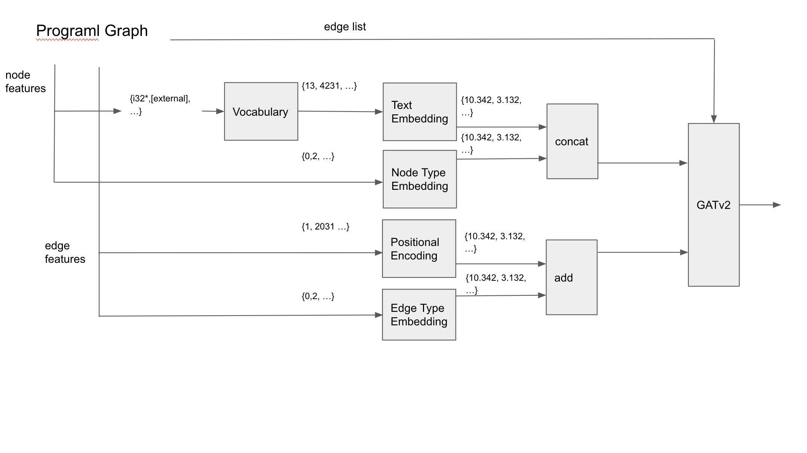

# ml-compiler-optimization

## prerequisites

system

`python==3.9` `cuda==11.3`

torch 

`pip3 install torch torchvision torchaudio --extra-index-url https://download.pytorch.org/whl/cu113`

pip packages

`requirements.txt`

---
## Encoder

Transform hetergeneous graph to homogeneous graph, 

by embedding **node/edge types** in Euclidean space

**Node identifiers** are translated to integer by vocabulary dictionary.

**Edge positions** are embedded by positional embedding from original Transformer.

[TODO] find where : `vocab.json` is from somewhere in https://github.com/ChrisCummins {with-different-name}.json, can't find exact location.

## RL 

Actor-Critic, and the loss is

PPOv2(clipped gradient version) with shared/unshared encoder.

Model updated in asynchronous manner.

Each `benchmark` is an _episode_, episodes are aligned(rolled out) in parallel, as much as our resource allows.

This is to remove temporal correlation(just like what replay memory does) 

## notes
since every implementations differ from each other little bit,

implemented with 3 versions

1. from scratch `_rl2` 
2. rllib `rllib*.py` - distributed computing
3. some PPO impl. from github `PPO-PyTorch` - someone from leaderboard refered to it
